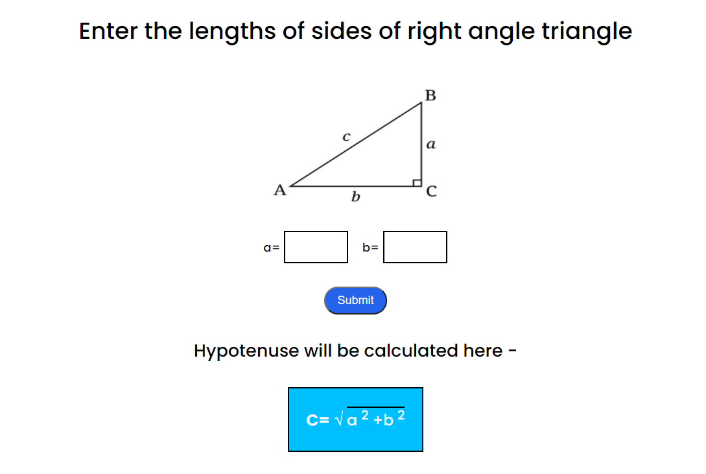

<h1 align="center">Triangle Trivia✨</h1>

<p align="center"><font size="4">How well do you know about Triangles?✨ <br>Test your knowledge of different types of Triangles, angles of a triangle, Area, hypotenuse and concepts like that using this app👇</font></p>

<h1 align="center">Links🌐</h1>

<h2 align="center">Check out this App <a href="https://trignometry-trivia.netlify.app/">here</a>!🚀</h2>

<h1 align="center">Images/Screenshots</h1>

<p align="center">

</p>

## 🛠️ Installation Steps

1. Clone the repository

```Bash
git clone https://github.com/Devansu-Yadav/Fun-with-Triangles.git
```

2. Change the working directory

```Bash
cd Fun-with-Triangles/
```

3. Run the app locally using the <b>Go Live Extension</b> on <b>VS Code</b>

## 👷 Built with

- HTML
- CSS
- Vanillajs